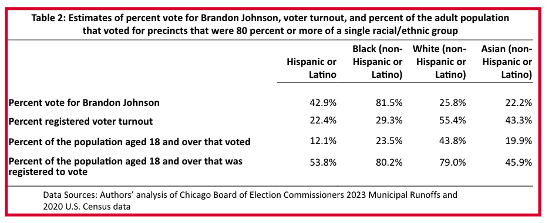
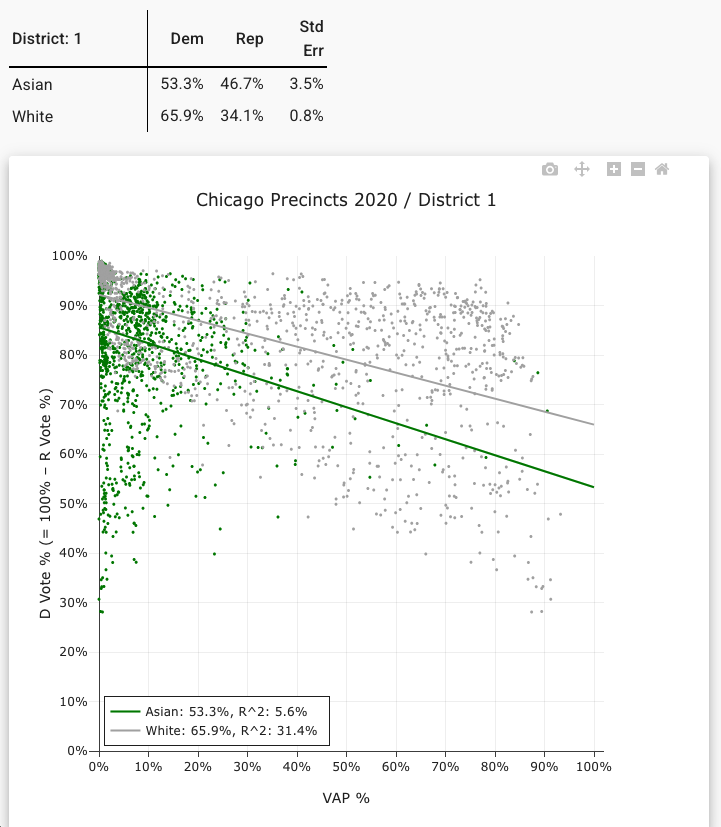

# Cohesion Paramter Decisions

This document contains information about how we arrived at the chosen cohesion parameters for each our our voting blocs: hispanic, black, and white.

## Cohesion Matrix

| bloc ↓ / slate → | W | B | H | A |
|---|---|---|---|---|
| **W** | 0.50 | 0.15 | 0.15 | 0.20 |
| **A** | 0.30 | 0.10 | 0.10 | 0.50 |
| **B** | 0.15 | 0.70 | 0.10 | 0.05 |
| **H** | 0.15 | 0.10 | 0.65 | 0.10 |

### White Cohesion

We have a few pieces of evidence that point us in the direction of white voters tending to predominately support white candidates. The first is that in two of the three last mayoral elections, white voters supported the white candidate in the runoff at a rate of 2-to-1. According to the [Brookings Institute in 2015](https://www.brookings.edu/articles/what-we-learned-from-the-chicago-mayoral-results/), Rahm Emanuel carried ~67% of the white vote while Chuy Garcia picked up ~33%. Similarly in 2023, white voters turned out for Paul Vallas at around 66% and Brandon Johnson at around 34%. Given that Garcia is hispanic and Johnson black, there seems a clear preference for white voters to support white candidates. However, MGGG's 2019 report included an ecological regression to estimate white voter support for two white candiates (Daley and Joyce) and two black candidates (Preckwinkle and Lightfoot) in the 2019 mayoral selection. In this estimation, combined support for the black candidates outpaced that of Joyce, who had an estimated 25% of white voter support. The report notes that this was counter-intuitive and provided evidence against simple racial-bloc assumptions. 

White voter support for Asian candidates is less clear, as Chicago has never had an Asian mayoral candidate make it to a runoff. Combined with the fact that Chicago generally doesn't elect many Asian Americans to city council (this could be the result of poor Asian candidate availability,) we have to work off of an assumption that while Asian candiates could receive a moderate amount of crossover support from white voters, it likely isn't much higher than black or hispanic candidates.

`W > A > B ~ H`

### Asian Cohesion

Establishing Asian voting bloc cohesion is challenging due to a lack of available data. Following the 2023 Chicago mayoral election, The University of Illinois-Chicago published a report estimating racial demographic support for both Brandon Johnson and Paul Vallas. The authors use ecological regression to estimate Asian voter support for Brandon Johnson: around 22%. Note that here, the estimates are for precincts that has one racial/ethnic group consisting of more than 80% of the precincts VAP. 

While we can see that the percent vote estimate for white voters here differs from the overall estimate, the closeness of white and Asian suppport for Johnson suggests that Asian  voters may have similar voting preferences and behavior. Additional evidence of this can be found by running an ecological regression through Dave's Redistricting analysis tools comparing white and Asian voters. The election data used here is a composite of Chicago elections from 2020-2024, include state senate, presidential, and mayoral elections that fell within that timeframe.

As such, we've chosen our cohesion paramters for Asian voters so as to give the highest weight to Asian candidates, then white candidates, and finally an even weight split between Hispanic and Black candidates.

`A > W > B ~ H`

### Black Cohesion

We use the earlier estimates from the 2019 MGGG report, the Brookings Institute article, and the 2023 UIC study to derive our Black voter cohesion parameters. Black voters were estimated to have overwhelmingly supported Johnson at 88% in 2023, and supported Garcia at 42% in 2015. We can also find similar data for the 2019 election, where the combined support for Black mayoral candidates was strong. The strong preference for Black candidates is also evidenced by the fact that there are 20 black alderpersons on Chicago's city council today - a bit above the Black share of the VAP. 

Black voter support for Asian candidates is a bit less clear for reasons aforementioned, so some assumptions need to be made about their willingness to crossover. Since we have some estimates providing a bit of evidence about Black voter preferences, we set the cohesion parameters in such as way that Black candidates are weighted highest, followed by white, Hispanic, then Asian candidates.

`B > W > H > A`

### Hispanic Cohesion

Lastly, we use the same sources to set our voting cohesion parameters for the Hispanic voting bloc. In 2015, Hispanic voters were estimated to have supported Garcia over Emanuel two-to-one, with Garcia picking up ~67% of the Hispanic vote. Candidate support in the 2023 race was a bit more split, with Vallas securing an estimate 55% of the vote to Johnson's 45%. The Brookings Institute speculates that there might have been an uptick in support for Vallas due to the Spanish appearance of his surname (it's most likely Greek in origin, as Vallas the man is of Greek extraction).

While it's clear that a Hispanic candidate is likely to receive strong Hispanic bloc support, it's less clear what follows. We have evidence that a white candidate might receive a moderate amount of support, followed then by a Black candidate. Support for an Asian candidate is still unclear without more data, so we'll presume that Hispanic voter preference takes the form of:

`H > W ~ B > A`