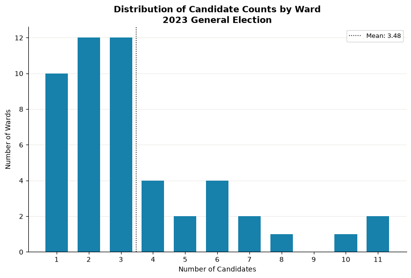
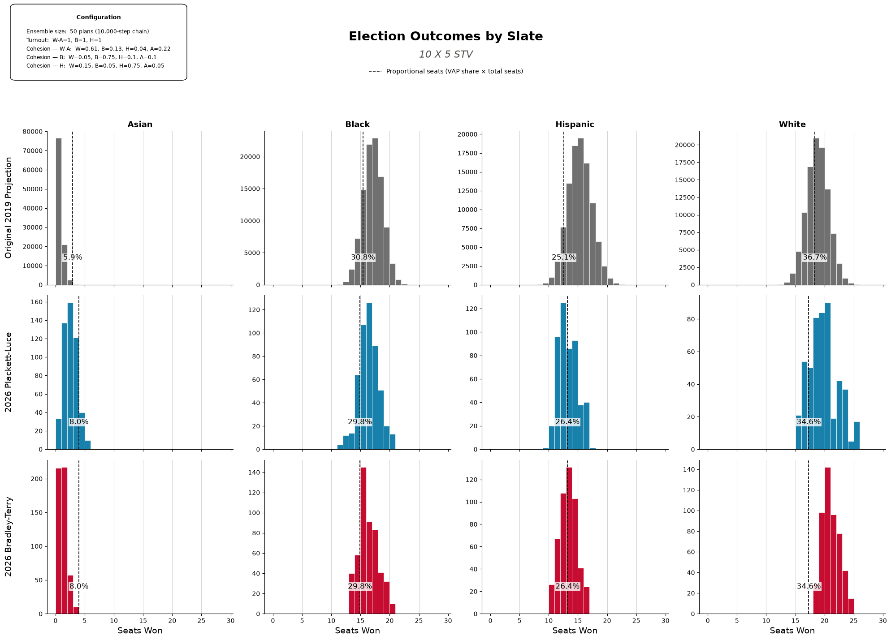

# Revisiting Reform Proposals for Chicago City Council

## Contents

- [Background](#background)
- [Data](#data)
- [Methodology](#methodology)
  - [Candidate Availability](#candidate-availability)
- [Shared parameters](#shared-parameters)
- [Cohesion matrices](#cohesion-matrices)
- [Election Scenarios](#4-election-scenarios)
  - [Comparison to 2019 Report - 10 X *m* STV](#41-comparison-to-2019-report---10-x-m-stv)
  - [Status Quo - 50 X 1 Plurality/IRV](#42-status-quo---50-x-1-pluralityirv)
  - [Low Voter Turnout](#43-low-voter-turnout)
  - [Optimizing for Larger Asian VAP Districts](#44-optimizing-for-larger-asian-vap-districts)
- [Appendix](#appendix)
  - [A. Configurations](#a-configurations)

  <h3> Abstract </h5>
  In April 2019, the Metric Geometry and Gerrymandering Group published a study on reform proposals and alternative electoral systems for Chicago City Council, stating that many observers would agree that Chicago's City Council ward system is entrenched in problematic gerrymandering, segregation, and inefficiency - issues many would argue still persist today. The goal of the 2019 study was to apply mathematical models to analyze the then-active ward plan and propose reforms to address these problems. This report seeks to replicate and update the results of the 2019 study by using the more current ward plan, newer demographic data, and more refined techniques that the lab has since developed. We will additionally be examining the impacts of the included reform proposals on representation for Asian voters - a voting bloc that has consistently gone underrepresented in Chicago City Council.

## 1. Background

The Chicago city council--both then and now--elects council members (alderpersons) from **50 single-member districts (wards)** using a runoff system that sees the top two vote-getters in a general election face each other in a runoff election if no candidate has secured a majority vote in the general. Since 2019, Chicago has had another city council election in 2023 in which [xx] new members were elected to city council. It was also the first city-wide election to use the new district maps drawn up after the latest decennial census in 2020. Combined with the shifting demographics and geography of the city, we thought it worthwhile to revisit the 2019 report and apply more mature methods to an analysis of Chicago city council elections.

This report employs new and updated tools like GerryChain and VoteKit in order to simulate a variety of electoral systems and scenarios - both from the original report and more novel configurations. Primarily, we look at simulations of multi-member districts elected by **Single Transferable Vote (STV)**, low person-of-color turnout, and optimizing for larger Asian bloc percentage-share in both 50 and 10 district plans.

## 2. Data

### 2.1 Data units, collection, preprocessing

In this report, we have updated our demographic data source to use the 2020 Decennial Census from the United State Census Bureau - the 2019 report utilized the 2010 Decennial Census. The census provides census block-level data. Out of the 98,230 blocks located in Cook County, 38,785 of these fall within Chicago city boundaries. Before we generate our mapping ensemble, we aggregate data from census blocks up into ward precincts to serve as the base geographic unit.

Shapefile data for Chicago's wards and precincts has been obtained from the [Chicago Open Data Portal](https://data.cityofchicago.org/Facilities-Geographic-Boundaries/Boundaries-Ward-Precincts-2025-/i8fv-xe4b/about_data). By December 1 in the year following the release of every Decennial Census, Chicago's ward boundaries must be redrawn to reflect the population as demonstrated in the census. We use the most recent ward and precinct boundaries, which were redrawn on May 16, 2022. It is notable that while the overall count of 50 wards across the city remains the same, the total number of [precincts has dropped](https://news.wttw.com/2022/08/29/chicago-board-elections-shrinks-number-precincts-nearly-40) from 2069 to 1291 - a significant decrease of nearly 40% [1].  

### 2.2 Racial demographics and population shifts

This report mirrors the 2019 study in how it manages distinctions between racial demographics: Black referring to Black non-Hispanic population, White for White non-Hispanic, Asian for Asian non-Hispanic, and Hispanic/Latino for all people designated with the Hispanic ethnicity in the census regardless of race.

Table 1. Chicago population by race and ethnicity across census and ACS vintages.

| Race | 2000 (Census) | 2010 (Census) | 2009-2013 (ACS) | 2013-2017 (ACS) | 2020 (Census) |
|---|---|---|---|---|---|
| Black (non-Hispanic) | 36.4% | 32.4% | 31.9% | 30.1% | 28.7% |
| White (non-Hispanic) | 31.3% | 31.7% | 32.2% | 32.7% | 31.4% |
| Hispanic | 26.0% | 28.9% | 28.7% | 29.0% | 29.8% |
| Asian (non-Hispanic) | 4.3% | 5.4% | 5.7% | 6.2% | 6.9% |
| Two or More Races | 1.6% | 1.3% | 1.3% | 1.7% | 2.6% |
| Amer. Indian/Alaska Native | 0.1% | 0.2% | 0.1% | 0.1% | 0.1% |
| Some Other Race | 0.1% | 0.2% | 0.2% | 0.2% | 0.4% |
| Nat. Hawaiian/Pacific Islander | 0.03% | 0.02% | 0.02% | 0.02% | 0.02% |
| Total Population | 2,896,016 | 2,695,598 | 2,706,101 | 2,716,450 | 2,746,424 |

Notable here is the slight growth in share for both the Hispanic and Asian populations - and the sizeable decrease of the Black share of the population, around a 3.7% decrease since the 2010 census. While neighborhood and community demographic makeup in the city continues to change, Chicago remains highly segregated, with 287 voting precincts being more than 80% Black and 116 being more than 80% Hispanic. At the time time, 805 precincts are less than 20% Black, and 744 are less than 20% Hispanic.

Table 2. Number of Chicago precincts falling in each band of population share, by racial/ethnic group.

| Precincts (1,291 total) | 0-20% | 20-40% | 40-60% | 60-80% | 80-100% |
|---|---|---|---|---|---|
| White | 588 | 165 | 211 | 269 | 57 |
| Black | 805 | 73 | 55 | 70 | 287 |
| Hispanic | 744 | 201 | 134 | 95 | 116 |
| Asian | 1,187 | 85 | 11 | 4 | 3 |

--- 
*[1] The Chicago Board of Elections cites that efficiency concerns, along with the continued popularity of mail-in ballots following the COVID-19 pandemic, are the primary driver in decreasing the overall number of precincts - and therefore polling places. We believe this is important to note, as polling place availability and accessibility (or lackthereof) is a known historical determinant in electoral disenfranchisement and representation.*

## 3. Methodology

### 3.1 Districting Plan Ensembles

To generate a sufficient number of distinct districting plans, we use GerryChain to run a 10,000-step ReCom chain and subsample 50 plans that will be used in our election simulations. We do this a total of four times - once for each of the following configurations:

- 50 x 1 ensemble - each plan has 50 single-member districts built from precincts
- 10 x *$m$* ensemble - each plan has 10 multi-member districts built from precincts
- 50 x 1 optimized ensemble - each plan has 50 single-member districts built from precincts, but we attempt to sample plans that have a higher number of districts with an Asian population over 20%. 
- 10 x *$m$* optimized ensemble - each plan has 10 multi-member districts built from precincts, but we attempt to sample plans that have a higher rnumber of districts with an Asian population over 15%. 

Given that Asian voters have been consistently underpresented within Chicago's city council, a goal of the report is to understand the conditions under which proportional representation could be achieved - including intentional redistricting to optimize for more wards with larger Asian populations. We accomplish this by using the Gingleator optimizer within the GerryChain library. The optimizer will perform "short bursts" of 100 steps to identify and select a plan according to a provided scoring function and target population threshold. We use the default score function that simply keeps track of plans with the highest number of districts that meet our threshold criteria. In the case of 50 district plans, we set that threshold at 20%, and in 10 district plans we set it at 15%. 

### 3.2 Voter Blocs and Candidate Slates

Mirroring the 2019 report, we consider the four largest racial demographic groups when identifying blocs of voters with shared preferences and slates of candidates with similar policies and positions. Slates are limited to and delineated by Black, Asian, Hispanic, and White candidates. Voter blocs follow this with a major exception: we made the decision to combine White and Asian voters into a single bloc. The reasoning for this is guided by evidence that Asian and White voters in Chicago demonstrate similar behaviors and preferences at the ballot box, particularly when looking at the last several mayoral and city council elections. While there currently exists no expansive data sets or analysis examining Asian voting behavior in Chicago elections, a handful of examples do exist: MGGG's previous application of Goodman's Ecological Regression on [add source here] and [Greater Cities Institute's](https://uofi.app.box.com/s/g2wlv9836atormomsn64alse2ysapjrd) application of ecological inference on voters in the 2023 mayoral election. Considering the similarities in behavior between the two blocs, we model them as a single bloc for the purposes of this analysis.

### 3.3 Candidate Availability and Pool Size

To simulate candidate availability per-ward for each voting bloc, we make a few decisions and assumptions guided by available evidence from previous Chicago general city council elections. The first is deciding how many total candidates will be on the ballot for a given ward. In 2023, the average number of candidates running across all 50 wards (not counting write-ins) was approximately 3.48, with a large number of wards featuring anywhere between one to four candidates in the election, and fewer featuring counts larger than five.

Figure 1. Number of candidates per ward in the 2023 Chicago City Council general election (write-ins excluded).

To model this in our simulation, we sample from the geometric distribution. For 50 district configurations, we use a probability value of $0.2$, which provides an expected value of $5$ - slightly above the average total candidates running per district in 2023. For 10 district configurations, we use a probability value of $0.1$, which provides an expected value of $10$. Generally, we'd expected plans with larger districts to see more candidates pursuing seats on council. We sample in this way for every single district in every subsample of the districting ensemble, allowing some variance in total available candidates across districts and plans. However, because generating values in this way could result in a candidate pool size that is large enough to be unrealistic (and computationally expensive,) we set a cap on the total candidates by making a calculation with the district VAP:

$$Max\ Candidates = \lceil log_{10}(District\ VAP) \rceil$$

The application of the logarithmic function with each district's VAP as input serves to mirror the maximum observed candidates in the 2023 general election - 11 candidates in both Ward 5 and Ward 6. Since each ward in the existing 50 district maps contains an average of 44,000 constituents in the voting age population, this calculation will result in 11 total candidates. Using the same formula, maps with 10 districts will be expected to see a cap of 13 candidates - the reasoning here that larger districts with more seats available would see a larger candidate pool with the size limited by the willingness or ability of would-be candidates to persist their campaigns until election day. Our "floor" minimum value is trival by comparison - here we set a minimum value *$m$* that is equal to the number of seats per district, so we never allow a sampled number to be lower than the per-district seats.

Next, we make an assumption that the racial composition of the slate pool will be roughly proportional to that of the VAP in each district. Using the bloc proportions to create an interval with the intent to sample candidates of different slates from this interval. However, before we do we first square each element, normalizing the "squared interval" over the sum of the squared values. This creates an "exaggeration" effect when we sample slate candidates. In other words, if a district has a large Black VAP, it's even more likely that the Black voter-preferred slate of candidates will be larger than the others. Similarly, if the Asian VAP is small it's much less likely that the Asian voter-preferred slate will have many candidates - if any, since we allow for slates to be empty. This is intended to model how community dynamics, segregation, or lack of institutional support may impact candidate availability across geography with respect to race.

### 3.4 Voter Profile and Ballot Generation

For each district in all 50 district plans of our ensemble, we generate voter preference profiles - a collection ballots from voters that rank available candidates. These rankings are determined by using VoteKit's Plackett-Luce and Bradley-Terry ballot generators, which model impulsive voter behavior and deliberative voter behavior, respectively. Each assumes that each voter bloc has a preference interval for each slate of candidates, along with tuple of cohesion parameters - one parameter for each slate.

Both generators share the same two-stage process, and they only differ in how the first stage plays out. Before any ballots are drawn, each bloc's preference interval is assembled by taking that bloc's cohesion for a given slate and slicing off a sub-interval of that width, then filling it in with the individual candidates of the slate according to their support. We govern the within-slate split with a set of Dirichlet alphas - in this report we hold all alphas at 1, which means that once a voter has decided to reach for a particular slate, every candidate on that slate is treated as equally preferred. The cohesion parameters (the rows of the matrices below) therefore do all the work of ordering *slates* against one another, while the interval handles the ordering of candidates *within* a slate. What separates the two models is the story we tell about how a voter walks through that interval to produce a ranking.

#### The Impulsive Voter

The Plackett-Luce generator builds a ballot from the top down, one position at a time. Starting from the first-place slot, a voter in bloc $X$ reaches for a candidate from slate $S$ with probability equal to that bloc's cohesion for the slate, $\pi_{X,S}$; whichever slate is chosen then supplies a specific candidate by sampling from that slate's preference interval without replacement. The voter repeats this for the next position, renormalizing over whatever slates still have candidates left, and keeps going until the ballot is full. We call this the *impulsive* voter because they never look back - each ranking is a snapshot decision made in the moment, with no reconsideration of the choices already committed higher up the ballot. Concretely, a voter picks their favorite, then their next favorite from what remains, and so on, so the probability of a given slate ordering is just the product of these sequential draws.

#### The Deliberative Voter

The Bradley-Terry generator instead asks the voter to weigh the ballot as a whole. Rather than filling positions in sequence, the probability of a complete ranking is proportional to the product of the pairwise slate preferences across *every* pair of slates on the ballot - for a ranking that places slate $S_i$ above slate $S_j$, each such head-to-head contributes a factor of $\pi_{X,S_i} / (\pi_{X,S_i} + \pi_{X,S_j})$. A voter effectively runs every candidate against every other in their head and only then settles on the ordering that is most internally consistent with all of those matchups at once. We call this the *deliberative* voter, since the ranking reflects a considered comparison of the full field rather than a run of top-down impulses. The candidate-filling stage is identical to Plackett-Luce - once the slate ordering is fixed, specific candidates are drawn from each slate's preference interval - so the two models diverge only in how much of the ballot a voter is imagined to be considering at once.

#### Cohesion Matrices

Rows are voter blocs, columns are candidate slates; each row sums to 1.

**Standard 3-bloc:**

Table 3. Standard three-bloc cohesion matrix: each voter bloc's support split across the candidate slates (rows sum to 1).

| bloc ↓ / slate → | White | Asian | Black | Hispanic |
|---|---|---|---|---|
| **White-Asian** | 0.61 | 0.22 | 0.13 | 0.04 |
| **Black** | 0.05 | 0.10 | 0.75 | 0.10 |
| **Hispanic** | 0.15 | 0.05 | 0.05 | 0.75 |

The `White-Asian` row is the VAP-weighted average (81% White / 19% Asian) of the
underlying White and Asian rows (below).

Table 4. Four-bloc cohesion matrix with White and Asian voters modeled as separate blocs (rows sum to 1).

| bloc ↓ / slate → | White | Asian | Black | Hispanic |
|---|---|---|---|---|
| **White** | 0.70 | 0.10 | 0.15 | 0.05 |
| **Asian** | 0.20 | 0.75 | 0.03 | 0.02 |
| **Black** | 0.05 | 0.10 | 0.75 | 0.10 |
| **Hispanic** | 0.15 | 0.05 | 0.05 | 0.75 |

The cohesion parameters here have been selected based on available estimates (from ecological regression) from the earlier 2019 MGGG study on Chicago city council reform, as well as a mayoral election analysis from the Greater Cities Institute.

### 3.5 Voting Rules

Elections for each district are simulated using VoteKit's Elections module. We use the following voting rules with the corresponding district configurations:

Table 5. Voting rules used in the report and the district configurations they are applied to.

| Voting Rule | District Configs | Seats/District | Description |
|---|---|---|---|
| **Plurality** | 50 × 1 | 1 (single-winner) | Voters' first choices are tallied and the candidate with the most votes wins outright - no majority required. This is the closest to Chicago's current status-quo. |
| **IRV** (Instant-Runoff Voting) | 50 × 1 | 1 (single-winner) | The single-winner case of STV: last-place candidates are eliminated round by round and their ballots transferred to the next-ranked choice until one candidate holds a majority. |
| **STV** (Single Transferable Vote) | 10 × 5, 10 × 3 | 5 or 3 (multi-winner) | Multi-winner ranked-choice rule using the Droop quota: candidates reaching the quota are elected and their surplus is redistributed, while last-place candidates are eliminated and transferred, until all seats are filled. |

For each system, tiebreaks are performed randomly when needed.

## 4 Election Scenarios

In the following sections, we highlight the results of a number of electoral scenarios that were simulated using the methodology described earlier. We first draw a comparison to the results of the original 2019 study using 10 X 5 STV and 10 X 3 STV. Then, we simulate Chicago's current status quo using 50-district maps with PSMD and IRV voting rules. Next, we attempt to optimize 10 X 5 and 50 X 1 district plans for a larger number of higher-percentage Asian VAP districts. Lastly, we wrap up with some exploratory analysis of our findings. 

The total number of election outcomes per-simulation is set by the district configuration:
each ensemble subsamples 50 plans, every plan runs one election per district,
and every district profile is regenerated across replicates of preference profiles to achieve more variation in ballot across trials. The 50 × 1
configurations use 5 replicates while the 10-district configurations use 20, and
every profile is generated under both voter models (Plackett-Luce and Bradley-Terry),
so the count follows directly from the districts-per-plan, replicate count, and
two voter models of each configuration:

Table 6. Number of election outcomes produced by each district configuration.

| District Configuration | Districts / Plan | Sampled Plans | Replicates | Voter Models | Election Outcomes |
|---|---|---|---|---|---|
| 50 × 1 | 50 | 50 | 5 | 2 | 25,000 |
| 10 × 5 | 10 | 50 | 20 | 2 | 20,000 |
| 10 × 3 | 10 | 50 | 20 | 2 | 20,000 |

### 4.1 Comparison to 2019 Report - 10 X $m$ STV

Figure 2. Asian-preferred seat outcomes under the 10×5 and 10×3 STV configurations, compared against the 2019 study.

#### 10 × 5 STV

Figure 3. Citywide seats won by Asian-preferred candidates across the sampled plans, shown per voter model with a pooled combined row; bubble size reflects how often each seat count occurred.

Figure 4. Seats won by each slate's preferred candidates — White, Black, Latino, and Asian — broken out by voter model.

Figure 5. Win rate for the Asian-preferred coalition by district, with districts ranked from lowest to highest Asian VAP share.

#### 10 × 3 STV

Figure 6. Citywide seats won by Asian-preferred candidates across the sampled plans, shown per voter model with a pooled combined row; bubble size reflects how often each seat count occurred.

Figure 7. Seats won by each slate's preferred candidates — White, Black, Latino, and Asian — broken out by voter model.

Figure 8. Win rate for the Asian-preferred coalition by district, with districts ranked from lowest to highest Asian VAP share.

### 4.2 Status Quo - 50 X 1 Plurality/IRV

#### 50 × 1 Plurality

Figure 9. Citywide seats won by Asian-preferred candidates across the sampled plans, shown per voter model with a pooled combined row; bubble size reflects how often each seat count occurred.

Figure 10. Seats won by each slate's preferred candidates — White, Black, Latino, and Asian — broken out by voter model.

Figure 11. Win rate for the Asian-preferred coalition by district, with districts ranked from lowest to highest Asian VAP share.

#### 50 × 1 IRV

Single-member wards (neutral districting), elected by Instant-Runoff Voting
instead of plurality — otherwise the same setup as Basic.

Figure 12. Citywide seats won by Asian-preferred candidates across the sampled plans, shown per voter model with a pooled combined row; bubble size reflects how often each seat count occurred.

Figure 13. Seats won by each slate's preferred candidates — White, Black, Latino, and Asian — broken out by voter model.

Figure 14. Win rate for the Asian-preferred coalition by district, with districts ranked from lowest to highest Asian VAP share.

### 4.3 Low Voter Turnout

Figure 15. Citywide seats won by Asian-preferred candidates across the sampled plans, shown per voter model with a pooled combined row; bubble size reflects how often each seat count occurred.

Figure 16. Seats won by each slate's preferred candidates — White, Black, Latino, and Asian — broken out by voter model.

Figure 17. Win rate for the Asian-preferred coalition by district, with districts ranked from lowest to highest Asian VAP share.

### 4.4 Optimizing for Larger Asian VAP Districts

#### 10 × 5 STV - Larger Asian Districts

Gingleator short-burst optimized ensemble, biasing the 10-district chain toward
higher-Asian-VAP-share districts instead of the neutral ReCom chain the other STV
runs use.

Figure 18. Citywide seats won by Asian-preferred candidates across the sampled plans, shown per voter model with a pooled combined row; bubble size reflects how often each seat count occurred.

Figure 19. Seats won by each slate's preferred candidates — White, Black, Latino, and Asian — broken out by voter model.

Figure 20. Win rate for the Asian-preferred coalition by district, with districts ranked from lowest to highest Asian VAP share.

#### 50 × 1 IRV - Larger Asian Districts

Single-member wards, IRV, with the same Gingleator opportunity-district
optimizer applied to the 50-district ensemble.

Figure 21. Citywide seats won by Asian-preferred candidates across the sampled plans, shown per voter model with a pooled combined row; bubble size reflects how often each seat count occurred.

Figure 22. Seats won by each slate's preferred candidates — White, Black, Latino, and Asian — broken out by voter model.

Figure 23. Win rate for the Asian-preferred coalition by district, with districts ranked from lowest to highest Asian VAP share.

#### 50 × 1 PSMD - Larger Asian Districts

Single-member wards, Plurality (PSMD), with the Gingleator opportunity-district
optimizer applied — the plurality counterpart to the IRV-optimized run above.

Figure 24. Citywide seats won by Asian-preferred candidates across the sampled plans, shown per voter model with a pooled combined row; bubble size reflects how often each seat count occurred.

Figure 25. Seats won by each slate's preferred candidates — White, Black, Latino, and Asian — broken out by voter model.

Figure 26. Win rate for the Asian-preferred coalition by district, with districts ranked from lowest to highest Asian VAP share.

## Appendix

### A. Configuration Reference

Table 7. Full list of simulated runs and their configuration parameters.

| Run Name | Districts | Seats | Voting Method | Voter Blocs | Turnout (bloc) |
|---|---|---|---|---|---|
| Basic – 50×1 Plurality | 50 × 1 | 50 | Plurality | W-A, B, H | 1.00 / 1.00 / 1.00 |
| Low POC Turnout | 10 × 5 | 50 | Single Transferable Vote (5 seats) | W-A, B, H | 0.75 / 0.50 / 0.50 |
| 10 × 3 STV | 10 × 3 | 30 | Single Transferable Vote (3 seats) | W-A, B, H | 1.00 / 1.00 / 1.00 |
| 10 × 5 STV | 10 × 5 | 50 | Single Transferable Vote (5 seats) | W-A, B, H | 1.00 / 1.00 / 1.00 |
| 10 × 5 STV - Larger Asian Districts | 10 × 5 | 50 | Single Transferable Vote (5 seats) | W-A, B, H | 1.00 / 1.00 / 1.00 |
| 50 × 1 IRV | 50 × 1 | 50 | Instant-Runoff Voting | W-A, B, H | 1.00 / 1.00 / 1.00 |
| 50 × 1 IRV - Larger Asian Districts | 50 × 1 | 50 | Instant-Runoff Voting | W-A, B, H | 1.00 / 1.00 / 1.00 |
| 50 × 1 PSMD - Larger Asian Districts | 50 × 1 | 50 | Plurality | W-A, B, H | 1.00 / 1.00 / 1.00 |
